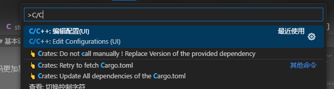
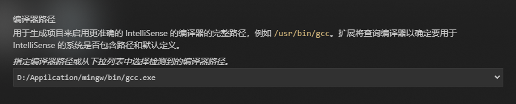

# C语言入门

不建议背诵, 建议在电脑上手打并执行查看结果, 理解为主, 记忆为辅

## Directory

vscode中直接点击跳转
Typora中按住Ctrl点击跳转

- [C语言入门](#c语言入门)
  - [Directory](#directory)
  - [英语名词 (English Noun)](#英语名词)
  - [基本语法 (Basic Syntax)](#基本语法-basic-syntax)
    - [注释 (Comment)](#注释-comment)
    - [预处理指令 (Preprocessor Directive)](#预处理指令-preprocessor-directive)
    - [入口函数 (Entry Function)](#入口函数-entry-function)
    - [标准输出 (Standard Output)](#标准输出-standard-output)
    - [变量 (Variable)](#变量-variable)
    - [常量 (Constant)](#常量-constant)
    - [数据类型 (Data Type)](#数据类型-data-type)
    - [运算符 (Operator)](#运算符-operator)
    - [函数 (Function)](#函数-function)
    - [条件语句 (Conditional Statement)](#条件语句-conditional-statement)
    - [循环语句 (Loop Statement)](#循环语句-loop-statement)
    - [数组 (Array)](#数组-array)
    - [字符串 (String)](#字符串-string)
    - [指针 (Pointer)](#指针-pointer)
    - [结构体 (Struct)](#结构体-struct)
    - [联合体 (Union)](#共用体-union)
    - [枚举 (Enum)](#枚举-enum)
    - [类型定义 (Typedef)](#类型定义-typedef)
  - [Write](#write)
  - [Update](#update)
  - [Reference](#reference)

## 英语名词

有简写的关注简写就行, 没有简写的关注全称.\
不需要背诵, 用于查阅

- `variable` 变量,  通常简写为`var`
- `function` 函数, 通常简写为`func`或者`fn`
- `parameter` 形参, 形式参数, 通常指函数声明中使用的变量, 通常简写为`param`
- `argument` 实参, 实际参数, 通常指函数调用中使用的变量, 通常简写为`arg`
- `return value` 返回值
- `return type` 返回类型
- `type` 数据类型
- `void` 空类型, 通常用于函数的返回类型, 表示不返回任何值
- `executable` 可执行文件, 是一种计算机程序文件格式, 通常简写为`exe`
- `boolean` 布尔类型, 通常简写为`bool`
- `integer` 整数, 通常简写为`int`
- `float` 浮点数
- `double` 双精度浮点数
- `char` 字符
- `string` 字符串
- `array` 数组
- `pointer` 指针
- `struct` 结构体
- `union` 联合体
- `enum` 枚举
- `typedef` 类型定义
- `default` 默认
- `case` 情况
- `break` 跳出
- `continue` 继续
- `while` 当...时
- `do while` 做...时
- `for` 为...时
- `if` 如果
- `else` 否则
- `else if` 否则如果
- `switch` 开关
- `include` 包含
- `define` 定义
- `macro` 宏
- `header` 头文件
- `source` 源文件


## 基本语法 (Basic Syntax)

### 注释 (Comment)

- 单行注释: `//`
- 多行注释: `/* */`

使用注释的目的是为了让代码更加易读, 便于理解. 注释的内容不会被编译器编译, 也就是说, 注释不会影响程序的运行.

```c
// 单行注释

/* 多行注释 */

/*
 * 多行注释
 * 多行注释
 */

/*
多行注释
*/
```

### 预处理指令 (Preprocessor Directive)

预处理指令是一种特殊的语法, 以`#`开头, 通常用于引入头文件, 定义宏等.

```c
#include <stdio.h> // 引入头文件

#define PI 3.14 // 定义宏
```

如果正在使用IDE的话，可以按住`Ctrl`键，然后点击`#include <stdio.h>`，就可以跳转到`stdio.h`文件中查看其内容了。

在编译时，这句指令的作用是将`stdio.h`文件的内容复制到当前文件中，也就是说，`stdio.h`文件中的内容和当前文件中的内容是一样的，所以，我们可以在当前文件中使用`stdio.h`文件中定义的函数, 例如`printf`函数.

`<>`通常表示引入的是标准头文件, 例如`stdio.h`文件.

`""`通常表示引入的是用户头文件, 例如`"myheader.h"`文件. 相关的知识点之后会提

```c
#include <stdio.h>
#include "myheader.h"
```

<details>
<summary> 如果在vscode中的无法点击 且输入库函数名时无法自动补全 点击此处展开查看解决方法 </summary>
可以点击键盘上的F1，输入C/C++，选择C/C++:Edit Configurations (UI) C/C++:编辑配置(UI)，在编译器路径一栏选择`...../mingw/bin/gcc.exe`
 

</details>

### 入口函数 (Entry Function)

入口函数是一种特殊的函数, 用于表示程序的入口, 通常是写程序的第一个函数, 例如`main`函数.

```c
int main() {
    // do something
    // getchar();
    return 0;
}
```

在所有的c语言项目中, 都必须有且只能有一个入口函数, 且入口函数的返回值必须为`int`类型

这里的0表示code 0 (正常退出), 表示程序正常退出

程序执行完毕后，会直接退出，如果想查看输入，可以在上述代码注释位置加上`getchar();`，这样程序执行完毕后，会等待用户输入一个字符，然后再退出。

<details>
<summary> 程序执行步骤 </summary>
<pre><code>/* 此处演示c中的程序执行步骤, 使用一个相对完整的代码进行演示 
右侧注释的数字代表执行的步骤数*/
#include &lt;stdio.h&gt;                  // 1  首先执行预处理指令
struct Person {
    int age;
    int height;
};
void log() {                        // 4  然后执行log函数
    printf("Hello World!\n");       // 5  打印Hello World!
}                                   // 6
int main() {                        // 2
    log();                          // 3   然后执行入口函数
    return 0;                       // 7   结束程序
}
</code></pre>
</details>

**之后的示例代码块中均默认写在main函数中！！！！！！！！！！！！！！**

### 标准输出 (Standard Output)

标准输出是一种特殊的输出, 通常用于输出一些信息, 例如`Hello World!`等.

标准输出需要先引入头文件`stdio.h`, 然后使用`printf`函数.

```c
printf("Hello World!\n");
```

`printf`是一个函数, 用于输出信息, 通常用于调试程序, 例如输出一些变量的值等.

`printf`函数的使用方法为: `printf("format", arg1, arg2, ...);`

`format`表示格式化字符串, 用于表示输出的格式.

`arg1, arg2, ...`表示参数, 用于表示输出的内容, 
例如\
`printf("%d", 10);`表示输出一个整数10, \
`printf("%f", 1.2);`表示输出一个浮点数1.2, \
`printf("%c", 'a');`表示输出一个字符a, \
`printf("%s", "Hello World!");`表示输出一个字符串Hello World!等.

`%`后面带字母的东西叫做格式化字符, 用于表示输出的格式

- `%d`表示输出一个整数
- `%f`表示输出一个浮点数
- `%c`表示输出一个字符
- `%s`表示输出一个字符串
- `%p`表示输出一个指针
- `%x`表示输出一个十六进制数
- `%o`表示输出一个八进制数
- `%e`表示输出一个科学计数法数
- `%g`表示输出一个浮点数或科学计数法数
- `%u`表示输出一个无符号整数

记前几个就行

在format中还会用到转义字符, 因为有些换行退格的操作没法直接输，所以用转义字符\来表示, 但是又要表示\，所以用两个\来表示一个\

- `\n`表示换行
- `\t`表示制表符
- `\\`表示反斜杠
- `\"`表示双引号
- `\'`表示单引号
- `\0`表示空字符
- `\r`表示回车
- `\b`表示退格
- `\nnn`表示八进制数
- `\xhh`表示十六进制数

记前几个就行

```c
printf("Hello World!\n");   // 结果为: Hello World!
printf("Hello\tWorld!\n");  // 结果为: Hello	World!
printf("Hello\\World!\n");  // 结果为: Hello\World!
printf("Hello\"World!\n");  // 结果为: Hello"World!
printf("Hello\'World!\n");  // 结果为: Hello'World!
printf("Hello\nWorld!\n");  // 结果为: Hello
                            //         World!
```

现代语言基本不用%了，像python中

```python
print("my age is {}, height is {}".format(18, 180))
# 结果为: my age is 18, height is 180
```

甚至还有更高级的用法f-string

```python
age = 18
height = 180
print(f"my age is {age}, height is {height}\n")
# 打印结果为: my age is 18, height is 180
```

但是转义字符还是比较常用的

### 变量 (Variable)

变量是一种存储数据的容器, 通常用于存储一些临时的数据, 例如用户输入的数据, 例如计算的结果等.

变量的命名规则:

- 变量名只能由字母, 数字, 下划线组成
- 变量名不能以数字开头
- 变量名不能是C语言的关键字
- 变量名区分大小写

这些不需要刻意去记，在使用的过程中，我们自有一套方法来命名变量，这些规则会自然而然的遵守。

在专业的生产中，我们尽量使用英文名称来命名变量，尽量避免使用拼音

且变量名要有意义，例如`int a;`这样的变量名是没有意义的，我们应该使用`int age;`这样的变量名。

在生产中通常使用两种命名方式:

- 驼峰命名法: `int PersonAge;`
- 下划线命名法: `int person_age;`

```c
// 变量的命名会尽量分类变量

// 例如通过数据类型来分类
int int_var;
float float_var;
double double_var;

// 例如通过变量的作用来分类
int person_age;     // 人的年龄
int person_height;  // 人的身高
int dog_age;        // 狗的年龄
int dog_height;     // 狗的身高
```

变量的声明和定义

- 声明: 告诉编译器, 这个变量的类型和名字
- 赋值: 告诉编译器, 这个变量的值

```c
// 声明
int age;

// 赋值
age = 18;

// 也可以同时完成声明和赋值，即直接进行初始化
int height = 99999;
```

### 常量 (Constant)

常量是一种存储数据的容器, 通常用于存储一些不会改变的数据, 例如圆周率`PI`, 例如一年的天数`DAYS_OF_YEAR`等.

常量的命名和使用和变量差不多, 但是常量的值不能改变.

```c
// 常量的命名建议使用全大写
const int DAYS_OF_YEAR = 365;
```

### 数据类型 (Data Type)

数据类型是一种特殊的类型, 用于表示数据的类型, 例如整数, 浮点数, 字符, 字符串等.

C语言中的数据类型分为两种:

- 基本数据类型
- 复合数据类型

复合数据类型之后会提到, 这里先介绍基本数据类型.

基本数据类型包括:

- 整数类型`int`
- 浮点数类型`float`
- 双精度浮点数类型`double`
- 字符类型`char`
- 布尔类型`bool`
- 空类型`void`

在初学者阶段, 只需要掌握整数类型, 浮点数类型, 字符类型, 布尔类型即可.

`int`表示的范围极广, 对初学者来说已经够用

```c
// int类型表示的范围为 -2147483648 ~ 2147483647
int a = 2147483647;
int b = -2147483648;

// float类型表示的范围为 1.2E-38 ~ 3.4E+38, 用于表示小数
float c = 1.2E-38;
float d = 3.4E+38;
float e = 1.9;

// char类型表示的范围为 -128 ~ 127, 用于表示字符
char f = 'a';
char g = 'b';
char h = 67; // 67对应的ASCII码为C
printf("%c\n", h); // 结果为: C

// bool类型表示的范围为 0 ~ 1, 用于表示真假
bool i = true;
bool j = false;
bool k = 1; // 1表示真, 0表示假

// void类型表示的范围为 无, 用于表示不返回任何值
```

### 运算符 (Operator)

运算符是一种特殊的符号, 用于表示运算, 例如加法运算符`+`, 减法运算符`-`等.

运算符分为:

- 算术运算符
- 赋值运算符
- 比较运算符
- 逻辑运算符
- 位运算符

考试时只需要掌握算术运算符, 赋值运算符, 比较运算符, 逻辑运算符即可.

算术运算符包括:

- 加法运算符`+`
- 减法运算符`-`
- 乘法运算符`*`
- 除法运算符`/`
- 取余运算符`%`

```c
// 注释后为运算结果
int a = 10;
int b = 3;

int c = a + b; // 13    10 + 3 = 13
int d = a - b; // 7     10 - 3 = 7
int e = a * b; // 30    10 * 3 = 30
int f = a / b; // 3     10 / 3 得3余1, 取3, 即取商数
int g = a % b; // 1     10 / 3 得3余1, 取1, 即取余数
```

赋值运算符包括:

- 赋值运算符`=`
- 加法赋值运算符`+=`
- 减法赋值运算符`-=`
- 乘法赋值运算符`*=`
- 除法赋值运算符`/=`
- 取余赋值运算符`%=`

```c 
int a = 10; // 将10赋值给a
int b = 3;

a += b; // a = a + b; 即 a = 10 + 3; a = 13;
a -= b; // a = a - b; 即 a = 13 - 3; a = 10;
a *= b; // a = a * b; 即 a = 10 * 3; a = 30;
a /= b; // a = a / b; 即 a = 30 / 3; a = 10;
a %= b; // a = a % b; 即 a = 10 % 3; a = 1;
```

比较运算符包括:

- 等于运算符`==`
- 不等于运算符`!=`
- 大于运算符`>`
- 小于运算符`<`
- 大于等于运算符`>=`
- 小于等于运算符`<=`

```c
int a = 10;
int b = 3;

bool c = a == b; // false   10不等于3，所以结果为假 false
bool d = a != b; // true    10不等于3，所以结果为真 true
bool e = a > b;  // true    10大于3，所以结果为真 true
bool f = a < b;  // false   10小于3，所以结果为假 false
bool g = a >= b; // true    10大于等于3，所以结果为真 true
bool h = a <= b; // false   10小于等于3，所以结果为假 false

// 这部分在之后的条件语句中使用较多, 会详细讲解, 在这里看不懂也没有关系
// 某些教科书可能会让你记住优先级, 不用理会, 后面的使用会自然而然的记住
```

逻辑运算符包括:

- 与运算符`&&`
- 或运算符`||`
- 非运算符`!`
- 异或运算符`^`

```c
bool a = true;
bool b = false;

bool c = a && b; // false   与运算符, 两个都为真才为真, 否则为假
bool d = a || b; // true    或运算符, 两个都为假才为假, 否则为真
bool e = !a;     // false   非运算符, 取反, true取false, false取true
```

位运算符包括:

- 与运算符`&`
- 或运算符`|`
- 非运算符`~`
- 异或运算符`^`
- 左移运算符`<<`
- 右移运算符`>>`

```c
// 拓展内容，爱看看，不看也行

int a = 10; // 二进制为: 0000 1010
int b = 3;  // 二进制为: 0000 0011

int c = a & b; // 2   与运算符, 两个都为1才为1, 否则为0
int d = a | b; // 11  或运算符, 两个都为0才为0, 否则为1
int e = ~a;    // -11 非运算符, 取反, 0取1, 1取0
int f = a ^ b; // 9   异或运算符, 两个相同为0, 不同为1
int g = a << 1; // 20  左移运算符, 将二进制数向左移动1位, 低位补0
int h = a >> 1; // 5   右移运算符, 将二进制数向右移动1位, 高位补0
```

### 函数 (Function)

函数和初高中学的没什么两样, 都是输入数据实现某种运算后输出.

例如最简单的一个数学函数 `y = 2x` , 输入一个数`x`, 将x乘于2后, 输出一个数`y`, 即结果.

在c语言中, 它的实现如下

```c
int double_x(int x) {
    y = x * 2;
    return y;
}

int main() {
    int x = 10;
    int y = double_x(x);
    printf("%d\n", y); // 结果为: 20
    return 0;
}
```

这个函数的名字叫`double_x`, 输入一个`int`类型的数`x`, `x`乘2后, 将结果赋值给`y`, 输出一个`int`类型的数`y`.

函数的命名规则和变量的命名规则一样, 但是函数的命名要有意义, 例如`double_x`这个函数的意思是将`x`乘于2, 所以命名为`double_x`.

```c
// 函数结构详解
/*
return_type function_name(param_type param1, param_type param2, ...) {
    // do something
    return value;
}
return_type: 返回类型, 例如int, float, double, char, bool, void等
function_name: 函数名, 例如 double_x
param_type: 参数类型, 例如int, float, double, char, bool, void等
param: 形式参数, 例如 x
*/

// 例子详解
/*
int double_x(int x) {
这里的int表示返回的y的类型为int, double_x表示函数的名字, 
int x表示这个函数需要一个参数x, 且x的类型为int

    y = x * 2;
    在函数中对参数进行操作, 例如这里的x乘于2后, 将结果赋值给y

    return y;
    返回y的值
}
*/

// 函数的调用详解

int x = 10; 
int y = double_x(x);    
/*这里的调用类似数学中的 f(x), 即将x的值传入函数中, 然后将结果赋值给y
f(x) = 2x, f(10)当然等于20, 这里又将20赋值给y, 所以y的值为20*/

void log() {    // 这里的void表示不返回任何值，这个函数只是用来打印一些信息
    printf("Hello World!\n");
}

int main(void) {    // 这里的void表示不接受任何参数, 在现代的标准中, 放空也是可以的
    // do something
    log();  // 这里调用了log函数，所以会打印Hello World!
    return 0;
}
```

函数声明后就可以像标准库函数一样使用了, 比如你写的函数和printf本质上的一样的，只不过人家的函数定义在stdio.h中，你的函数定义在你的文件中，人家写得高级一点，你写得辣鸡一点，但是本质上是一样的。

在写函数的过程中要写得规范，保证函数的可读性

```c
// 在这里或者
int double_x(int x) {
    /* 在这里写上函数的说明注释 */

    /*
    这是一个比较标准的注释格式， 很python的风格, 尽量使用英文
    description: Return the result of multiplying the value of x by 2.
    param: 
        x: int, the value of x.
    return:
        y: int, the result of multiplying the value of x by 2.
    */

    /** 这是一种C风格的注释
     * @brief Return the result of multiplying the value of x by 2.
     * 
     * @param x The value of x.
     * @return The result of multiplying the value of x by 2.
     */
    y = x * 2;
    return y;
}
// 变量名应尽量使用英文，注释量不应过多，不要写废话，你的一切注释都应为可读性服务

// 以下是printf函数的注释, 参考参考吧
/** 
 * @brief Writes the C string pointed by format to the standard output (stdout). 
 * If format includes format specifiers (subsequences beginning with %), 
 * the additional arguments following format are formatted and inserted in the resulting string 
 * replacing their respective specifiers.
 * 
 * @param format C string that contains the text to be written to stdout. 
 * It can optionally contain embedded format specifiers that are replaced by the values specified in subsequent additional arguments 
 * and formatted as requested.
 * @param ... Additional arguments containing the values to be inserted instead of the specifiers (if any). 
 * 
 * @return On success, the total number of characters written is returned.
 * If a writing error occurs, the error indicator (ferror) is set and a negative number is returned.
 */
```

在之后的进阶中, 会使用比较标准的文档方式来描述函数的使用方法, 例如

**printf函数**

- return_type: void
- param: 
    - format: char *
    - ...: ...
- return: void


### 条件语句 (Conditional Statement)

条件语句是一种特殊的语句, 用于表示条件的判断, 例如如果今天下雨, 我就带伞, 否则我就不带伞.

条件语句分为:

- if语句
- if-else语句
- if-else if-else语句
- switch语句

if语句的结构如下:

```c
if (condition) {
    // do something
}
```

if语句的意思是, 如果`condition`为真, 则执行`do something`这部分代码, 否则不执行.

```c
int a = 10;
int b = 3;

if (a > b) {
    printf("a > b\n"); // 结果为: a > b
}
```

if-else语句的结构如下:

```c
if (condition) {
    // do something 1
} else {
    // do something 2
}
```

if-else语句的意思是, 如果`condition`为真, 则执行`do something 1`这部分代码, 否则执行`do something 2`这部分代码.

```c
int a = 10;
int b = 3;

if (a > b) {
    printf("a > b\n"); 
} else {
    printf("a <= b\n");
}
// 结果为: a > b
```

if-else if-else语句的结构如下:

```c
if (condition 1) {
    // do something 1
} else if (condition 2) {
    // do something 2
} else {
    // do something 3
}
```

if-else if-else语句的意思是, 如果`condition 1`为真, 则执行`do something 1`这部分代码, 否则如果`condition 2`为真, 则执行`do something 2`这部分代码, 否则执行`do something 3`这部分代码, else if可以一直写下去. 即优先判断condition 1, 真就执行，假就继续按顺序判断, 直到有真, 如果都为假, 就执行`do something 3`这部分代码.

```c
int a = 10;
int b = 3;

if (a < b) {
    printf("a < b\n"); 
} else if (a > b) {
    printf("a > b\n");
} else {
    printf("a == b\n");
}
// 结果为: a > b
```

switch语句的结构如下:

```c
switch (expression) {
    case value 1:
        // do something 1
        break;
    case value 2:
        // do something 2
        break;
    default:
        // do something 3
        break;
}
```

switch语句的意思是, 如果`expression`的值等于`value 1`, 则执行`do something 1`这部分代码, 否则如果`expression`的值等于`value 2`, 则执行`do something 2`这部分代码, 否则执行`do something 3`这部分代码, default可以省略, 但是break不能省略, 否则会出现意想不到的结果. 

这里的default相当于上面的else, 起默认的作用, default可以省略, 但是else不能省略.


```c
int a = 10;

switch (a) {
    case 1:
        printf("a == 1\n");
        break;
    case 2:
        printf("a == 2\n");
        break;
    default:
        printf("a != 1 && a != 2\n");
        break;
}
// 结果为: a != 1 && a != 2
```

上文运算符的内容中提到，运算符的使用在条件语句中较多，因此在此再次提及

c语言中，表达式是由运算符和操作数组成的，例如`a + b`，`a`和`b`就是操作数，`+`就是运算符，`a + b`就是一个表达式。

在条件语句中, 由于变量的值通常是未知的, 所以使用表达式来进行判断, 例如上文的例子

```c
int a = 10;
int b = 3;

bool c = a && b; // false   与运算符, 两个都为真才为真, 否则为假
bool d = a || b; // true    或运算符, 两个都为假才为假, 否则为真
bool e = !a;     // false   非运算符, 取反, true取false, false取true
 
/*这里a && b, a || b, !a都是表达式, 且表达式的值都为布尔类型, 即true或false
a && b得出结果后, 将结果赋值给c, 但在条件语句中也可以直接使用表达式, 例如
*/

if (a && b) {
    printf("a && b\n"); 
} else if (a || b) {
    printf("a || b\n"); 
} else {
    printf("!a\n");     
}
// 结果为: a || b
```

除了上文的划分, 运算符还分为:

- `单目运算符` 指只有一个操作数的运算符, 例如`!a`, 有`&`, `*`, `+`, `-`, `~`, `!`等
- `双目运算符` 指有两个操作数的运算符, 例如`a + b`, 有`+`, `-`, `*`, `/`, `%`, `&`, `|`, `^`, `&&`, `||`, `==`, `!=`, `>`, `<`, `>=`, `<=`等
- `三目运算符` 指有三个操作数的运算符, 例如`a ? b : c`, 有`?:`等

```c
// 注释后加*的为需要掌握的内容

// 单目运算符
int a = 10;
int b = 3;

int c = &a; // 取地址运算符, 取出a的地址, 即&a
int d = *c; // 取值运算符, 取出c的值, 即*c
// 这里为下文指针的内容, 不需要理解

int e = +a; //* 正号运算符, 即a
int f = -a; //* 负号运算符, 即-a

int g = ~a; // 按位取反运算符, 即~a 结果为 -11 10的二进制为0000 1010取反后二进制为: 1111 0101, 转回十进制为: -11
// 按位取反运算符 ~ 只能用于整型数据类型，它将整个二进制数取反，包括符号位。在本例中，由于 a 的值为正数，所以取反后的结果为负数。 这里的例子仅作为拓展内容，不需要理解
int h = !a; //* 逻辑取反运算符, 即!a 结果为 false    10是非零数 为真, 取反为假, 即false

// 双目运算符
int i = a + b; //* 加法运算符, 即a + b
int j = a - b; //* 减法运算符, 即a - b
int k = a * b; //* 乘法运算符, 即a * b
int l = a / b; //* 除法运算符, 即a / b
int m = a % b; //* 取余运算符, 即a % b

int n = a & b; // 按位与运算符, 即a & b 结果为: 2   都为1才为1, 否则为0
// 10的二进制为: 0000 1010, 3的二进制为: 0000 0011, 按位与后二进制为: 0000 0010, 转回十进制为: 2
int o = a | b; // 按位或运算符, 即a | b 结果为: 11  有一个为1就为1, 否则为0
// 10的二进制为: 0000 1010, 3的二进制为: 0000 0011, 按位或后二进制为: 0000 1011, 转回十进制为: 11
int p = a ^ b; // 按位异或运算符, 即a ^ b 结果为: 9  相同为0, 不同为1
//10的二进制为: 0000 1010, 3的二进制为: 0000 0011, 按位异或后二进制为: 0000 1001, 转回十进制为: 9
// 这里同样作为拓展内容，不需要理解

int q = a && b; //* 逻辑与运算符, 即a && b 结果为: true  都为真才为真, 否则为假
int r = a || b; //* 逻辑或运算符, 即a || b 结果为: true  有一个为真就为真, 否则为假

int s = a == b; //* 等于运算符, 即a == b 结果为: false  相等为真, 不等为假
int t = a != b; //* 不等于运算符, 即a != b 结果为: true  不等为真, 相等为假
int u = a > b;  //* 大于运算符, 即a > b  结果为: true  大于为真, 小于为假
int v = a < b;  //* 小于运算符, 即a < b  结果为: false  小于为真, 大于为假
int w = a >= b; //* 大于等于运算符, 即a >= b 结果为: true  大于等于为真, 小于为假
int x = a <= b; //* 小于等于运算符, 即a <= b 结果为: false  小于等于为真, 大于为假

// 三目运算符

int y = a ? b : c; //* 三目运算符, 即a ? b : c 结果为: b  
// 如果a为真, 则结果为b, 否则结果为c
/*
类似Python中的
b if a else c
如果a为真，则结果为b，否则结果为c
*/
```

### 循环语句 (Loop Statement)

循环语句是一种特殊的语句, 用于表示循环的执行, 例如我需要每天上课，直到放假.

循环语句分为:

- while语句
- do while语句
- for语句

while语句的结构如下:

```c
while (condition) {
    // do something
}
```

while语句的意思是, 如果`condition`为真, 则执行`do something`这部分代码, 否则不执行, 执行完毕后再次判断`condition`是否为真, 如果为真, 则再次执行`do something`这部分代码, 否则不执行, 执行完毕后再次判断`condition`是否为真, 如果为真, 则再次执行`do something`这部分代码, 否则不执行, 执行完毕后再次判断`condition`是否为真, 如果为真, 则再次执行`do something`这部分代码, 否则不执行, 执行完毕后再次判断`condition`是否为真, 如果为真, 则再次执行`do something`这部分代码, 否则不执行, 执行完毕后再次判断`condition`是否为真, 如果为真, 则再次执行`do something`这部分代码, 否则不执行, 执行完毕后再次判断`condition`是否为真, 如果为真, 则再次执行`do something`这部分代码, 否则不执行, 执行完毕后再次判断`condition`是否为真, 如果为真, 则再次执行`do something`这部分代码, 否则不执行, 执行完毕后再次判断`condition`是否为真, 如果为真, 则再次执行`do something`这部分代码, 否则不执行, 执行完毕后再次判断`condition`是否为真, 如果为真, 则再次执行`do something`这部分代码, 否则不执行..............一直到`condition`为假为止.

```c
int i = 0;
while (i < 10) {
    printf("%d\n", i);
    i++;
}

// 结果为:
/*
0
1
2
3
4
5
6
7
8
9
*/
// 这里的i++表示i = i + 1, 即i自增1
// 同样的还有i--, 表示i = i - 1, 即i自减1
// 当i执行到9时, i++后i的值为10, 10 < 10为假, 所以不执行
```

do while语句的结构如下:

```c
do {
    // do something
} while (condition);
```

do while语句的意思是, 先执行`do something`这部分代码, 执行完毕后判断`condition`是否为真, 如果为真, 则再次执行`do something`这部分代码, 否则不执行, 执行完毕后再次判断`condition`是否为真, 如果为真, 则再次执行`do something`这部分代码, 否则不执行, 执行完毕后再次判断`condition`是否为真, 如果为真, 则再次执行`do something`这部分代码, 否则不执行, 执行完毕后再次判断`condition`是否为真, 如果为真, 则再次执行`do something`这部分代码, 否则不执行..............一直到`condition`为假为止.

```c
int i = 0;
do {
    printf("%d\n", i);
    i++;
} while (i < 5);

// 结果为:
/*
0
1
2
3
4
*/
// 常用的不止i++,i--，还有i += 1，i -= 3等, 但目前来说还是i++和i--用的最多
// 当i执行到4时, i++后i的值为5, 5 < 5为假, 所以不执行
```

for语句的结构如下:

```c
for (init; condition; increment) {
    // do something
}
```

for语句的意思是, 先执行`init`这部分代码, 执行完毕后判断`condition`是否为真, 如果为真, 则执行`do something`这部分代码, 否则不执行, 执行完毕后执行`increment`这部分代码, 执行完毕后再次判断`condition`是否为真, 如果为真, 则执行`do something`这部分代码, 否则不执行, 执行完毕后执行`increment`这部分代码, 执行完毕后再次判断`condition`是否为真, 如果为真, 则执行`do something`这部分代码, 否则不执行, 执行完毕后执行`increment`这部分代码, 执行完毕后再次判断`condition`是否为真, 如果为真, 则执行`do something`这部分代码, 否则不执行, 执行完毕后执行`increment`这部分代码, 执行完毕后再次判断`condition`是否为真, 如果为真, 则执行`do something`这部分代码, 否则不执行, 执行完毕后执行`increment`这部分代码, 执行完毕后再次判断`condition`是否为真, 如果为真, 则执行`do something`这部分代码, 否则不执行..............一直到`condition`为假为止.

```c
for (int i = 0; i < 5; i++) {
    printf("%d\n", i);
}

// 结果为:
/*
0
1
2
3
4
*/
// 这里首先执行i = 0, 接着判断i < 5, 然后打印i的值, 接着执行i++, 当i执行到4时, i++后i的值为5, 5 < 5为假, 所以不执行
```

### 数组 (Array)

数组是一种特殊的数据类型, 用于存储多个相同类型的数据.

数组的命名规则和变量的命名规则一样, 但是数组的命名要有意义, 例如`int ages[10];`这个数组的意思是存储10个人的年龄, 所以命名为`ages`.

数组的结构如下:

```c
type array_name[array_size];
```

这里的意思是, 定义一个`type`类型的数组, 数组的名字为`array_name`, 数组的大小为`array_size`.

```c
int ages[10];
```

这里的意思是, 定义一个`int`类型的数组, 数组的名字为`ages`, 数组的大小为`10`.

数组的使用如下:

```c
int ages[5];

ages[0] = 18;
ages[1] = 19;
ages[2] = 20;
ages[3] = 21;
ages[4] = 22;

printf("%d\n", ages[0]); // 结果为: 18

// 这里的ages[0]表示数组ages中的第一个元素, 即18
// 这里的ages[1]表示数组ages中的第二个元素, 即19
// ......
// 这里的ages[4]表示数组ages中的第五个元素, 即22
```

数组的初始化也有很多种方式, 例如:

```c
int ages[5] = {18, 19, 20};
// 为什么这里只有3个元素呢? 数组的大小为5, 但是只有3个元素, 剩下的两个元素会自动初始化为0

int ages[5] = {0};
// 这里的0表示数组的每个元素都初始化为0

int ages[5] = {0, 1, 2, 3, 4};
// 这里的0, 1, 2, 3, 4表示数组的每个元素都初始化为0, 1, 2, 3, 4

int ages[] = {18, 19, 20, 21, 22};
// 这里的[]中没有数字, 编译器会自动计算数组的大小, 这里的数组大小为5

int ages[5] = {18, 19, 20, 21, 22, 23};
// 这里的数组大小为5, 但是初始化了6个元素, 编译器会报错, 因为数组的大小为5, 但是初始化了6个元素

int ages[5];
for (int i = 0; i < 5; i++) {
    ages[i] = i + 18;
}
// 通过循环初始化数组
```

### 字符串 (String)

字符串是一种特殊的数据类型, 用于存储多个字符.

字符串的命名规则和变量的命名规则一样, 但是字符串的命名要有意义, 例如`char name[10];`这个字符串的意思是存储10个字符的名字, 所以命名为`name`.

字符串的结构如下:

```c
char string_name[string_size];
```

这里的意思是, 定义一个`char`类型的字符串, 字符串的名字为`string_name`, 字符串的大小为`string_size`.

```c
char name[10];
```

这里的意思是, 定义一个`char`类型的字符串, 字符串的名字为`name`, 字符串的大小为`10`.

字符串的使用如下:

```c
char name[10] = "Hello";
printf("%s\n", name); // 结果为: Hello

// 这里的%s表示字符串, 即name
```

字符串其实就是一种数组:

```c
char name[10] = "Hello";
// 这里的字符串的大小为10, 但是只有5个字符, 剩下的5个字符会自动初始化为0

printf("%c\n", name[0]); // 结果为: H
printf("%c\n", name[1]); // 结果为: e
printf("%c\n", name[2]); // 结果为: l

// name中的元素分别有: H, e, l, l, o, \0, \0, \0, \0, \0
```

### 指针 (Pointer)

指针是一种特殊的数据类型, 用于存储地址. 这也是对于初学者来说最难理解的一部分.

复习一下 `&` 和 `*` 运算符

- `&` 取地址运算符, 取出变量的地址, 即`&a`
- `*` 取值运算符, 取出指针指向的值, 即`*p`

指针的结构如下:

```c
type *pointer_name;
```

这里的意思是, 定义一个`type`类型的指针, 指针的名字为`pointer_name`.

```c
int *p;
```

这里的意思是, 定义一个`int`类型的指针, 指针的名字为`p`.

指针的使用如下:

```c
int a = 10; 
int *p = &a;    // 这里的*p和p是两个不同的东西, *p表示指针p指向的空间中的值, p表示指针p本身
printf("%d\n", *p); // 结果为: 10
printf("%p\n", p);  // 结果为: 000000000061FE18
printf("%p\n", &a); // 结果为: 000000000061FE18
printf("%p\n", &p); // 结果为: 000000000061FE10
printf("%d\n", a);  // 结果为: 10
/*
这里 a 为变量名，变量的值为10
&a 则是指a在内存的地址，即000000000061FE18
p 为变量名, 但并不是一个普通的变量, 而是一个指针变量, 它的值是一个int数据的地址, 这个int数据就是a
*p 则是指p指向的空间中的值, 即10
&p 则是p这个指针变量在内存的地址, 即000000000061FE10
不理解没关系, 先看下面
*/
```

如果要理解指针，则需要理解内存的概念

一台计算机分为

- CPU
- 内存条
- 硬盘
- 显卡
- 主板
- 散热
- 电源
- 等等

这里我们只需要关注内存部分, 计算机系统将内存抽象为一条线, 这条线上的每一个点都有一个地址, 例如`000000000061FE18`, 这个地址就是内存中的一个点, 这个点可以存储数据, 例如`10`, 这个点就存储了`10`.

这样讲有点过于抽象, 举一个现实一些的例子, 想象内存是一条无限长的街, 街上有很多房子, 每个房子都有一个地址, 里面都住了一个人

当我们`int a=10`时, 就是这个街上某栋房子a里住了一个人10, 但我们并不知道这个房子的地址, 我们只知道这个房子的名字叫a, 但是我们可以通过`&a`来获取这个房子的地址, 即`000000000061FE18`, 也可以通过这个地址找到这个人, 即`*&a == 10`

现在很奇怪, 我们`int *p = &a`, 这栋街上的某栋特殊的房子p里住进一个怪人, 这个怪人的名字不是普通的`10`, `'A'`之类的, 而是`000000000061FE18`, 他的名字是别人房子的地址, 那么他就能直接通过*他自己来直接找到那个人 `*p == 10`, 相当于这个怪人有了别人房子的钥匙, 他可以直接进去, 改掉那个人, 例如`*p = 11`, 那么那个人就变成了`11`

以上我们理解了什么是指针, 但是为什么要用指针, 以及怎么使用指针呢？举一个简单的例子

```c
// 交换两个变量的值

/*
这里需要对上文的function函数的知识做一些拓展, 理解何谓作用域
int double_x(int x) {
    int y = x * 2;
    return y;
}       
可以看到函数的结构中有一个 {}, 这个就是作用域, 函数中的变量只会在{}中生效, 一旦超越这个范围
变量就会被drop(抛弃)掉, 因此变量也分为全局变量和局部变量, 全局变量在整个程序中都可以使用, 
局部变量只会在函数的作用域中生效, 超越这个范围就会无效, 如例子中的x, y，但不同的是y被return
可以在外部通过y = double_x(x)来获取y的值, 但是x就不行, 因为x只在函数的作用域中生效
*/

// 不使用指针, 且没有返回值
void swap(int a, int b) {
    int temp = a;
    a = b;
    b = temp;
}

int a = 10;
int b = 20;
swap(a, b);
printf("%d\n", a); // 结果为: 10
printf("%d\n", b); // 结果为: 20
/*这里的a和b并没有交换, 因为swap函数中的a和b只在函数的作用域中生效, 超越这个范围就会无效
可以理解为swap函数中的a和b是另外两个变量, 与外部的a和b没有任何关系
也就是我们抽象出一条另外的街，将两栋房子里的人做了交换，但时间一到，这个平行世界也就崩坏了
影响不到现实世界的a和b*/

// 以下代码均默认已执行
int a = 10;
int b = 20;

// 不使用指针, 且有返回值
int swap(int a, int b) {
    int temp = a;
    a = b;
    b = temp;
    return a, b;
}

a, b = swap(a, b);
printf("%d\n", a); // 结果为: 10
printf("%d\n", b); // 结果为: 10
/*很遗憾，c中并不像其他语言一样，一个函数可以返回两个返回值， 也就是说，只有b的值发生改变*/

// 使用结构体
struct swap {
    int a;
    int b;
};

struct swap swap(int a, int b) {
    struct swap s;
    s.a = b;
    s.b = a;
    return s;
}

struct swap s = swap(a, b);
a = s.a;
b = s.b;
printf("%d\n", s.a); // 结果为: 20
/*我们成功用未学的知识完成了不使用指针来交换两个变量的值，但这样是否太过繁琐*/

// 使用指针
void swap(int *a, int *b) {     // 这里的*a和*b是指针, 与上文的*p是一样的, 但是这里的指针是函数的参数
    int temp = *a;              
    *a = *b;
    *b = temp;                  // 直接修改了地址指向的房子里的值
}// 就好像暴徒根据地址直接闯入了a和b两栋房子，并将房子的人进行了交换，这里并没有平行世界

swap(&a, &b);
printf("%d\n", a); // 结果为: 20
printf("%d\n", b); // 结果为: 10
/* 这里的代码使用了指针，相对于前面的代码，显得更加的优雅 */
```

### 结构体 (Struct)

结构体是一种特殊的数据类型, 用于存储多个不同类型的数据.

结构体的命名规则和变量的命名规则一样, 例如`struct student { int age; char name[10]; };`这个结构体的意思是存储学生的年龄和名字, 所以命名为`student`.

结构体的结构如下:

```c
struct struct_name {
    type1 member1;
    type2 member2;
    type3 member3;
    ...
};
```

struct是关键字, 表示开始定义结构体, 这里的意思是, 定义一个`struct_name`类型的结构体, 结构体的成员有`member1`, `member2`, `member3`, ... , 成员的类型分别为`type1`, `type2`, `type3`, ... .

```c
struct student {
    int age;
    char name[10];
};
```

这里的意思是, 定义一个`student`类型的结构体, 结构体的成员有`age`, `name`, 成员的类型分别为`int`, `char[10]`.

结构体的使用如下:

```c
struct student {
    int age;
    char name[10];
};

struct student s;
s.age = 18;
strcpy(s.name, "Jack"); // 这里的strcpy是一个函数, 用于将字符串复制到另一个字符串中, 例如strcpy(s.name, "Jack")的意思是将"Jack"复制到s.name中, 之所以使用strcpy是因为数组不能直接赋值, 例如s.name = "Jack"是错误的, 因为数组不能直接赋值, 只能通过strcpy来复制

printf("%d\n", s.age); // 结果为: 18
printf("%s\n", s.name); // 结果为: Jack

// 这里的s.age表示结构体s中的age成员, 即18
// 这里的s.name表示结构体s中的name成员, 即Jack
```

结构体的初始化也有很多种方式, 例如:

```c
struct student {
    int age;
    char name[10];
};

struct student s = {18, "Jack"};

struct student s = {};

struct student s;
```

### 共用体 (Union)

共用体是一种特殊的数据类型, 用于存储多个不同类型的数据, 但是共用体的成员共用一块内存.

共用体的命名规则和变量的命名规则一样, 例如`union student { int age; char name[10]; };`这个共用体的意思是存储学生的年龄和名字, 所以命名为`student`.

共用体的结构如下:

```c
union union_name {
    type1 member1;
    type2 member2;
    type3 member3;
    ...
};
```

union是关键字, 表示开始定义共用体, 这里的意思是, 定义一个`union_name`类型的共用体, 共用体的成员有`member1`, `member2`, `member3`, ... , 成员的类型分别为`type1`, `type2`, `type3`, ... .

```c
union student {
    int age;
    char name[10];
};
```

这里的意思是, 定义一个`student`类型的共用体, 共用体的成员有`age`, `name`, 成员的类型分别为`int`, `char[10]`.

共用体的使用如下:

```c
union student {
    int age;
    char name[10];
};

union student s;
s.age = 18;
strcpy(s.name, "Jack"); 

printf("%d\n", s.age); // 结果为: 18
printf("%s\n", s.name); // 结果为: Jack

// 这里的s.age表示共用体s中的age成员, 即18
// 这里的s.name表示共用体s中的name成员, 即Jack
```

共用体的初始化:

```c
union student {
    int age;
    char name[10];
};

union student s = {18};

union student s = {};

union student s;
```

Q: 结构体和共用体有什么区别?\
A: 
- 存储方式：结构体的成员存储在不同的内存空间中，共用体的成员共用同一块内存空间.
- 访问方式：结构体的成员可以通过成员运算符 `.` 来访问，共用体的成员也可以通过成员运算符 `.` 来访问，但是共用体的成员也可以通过共用体的指针来访问.
- **共用体同一时间只能存储一个成员的值，而结构体可以同时存储多个成员的值.**


### 枚举 (Enum)

枚举是一种特殊的数据类型, 用于存储多个相同类型的数据.

枚举的命名规则和变量的命名规则一样, 例如`enum weekday { Monday, Tuesday, Wednesday, Thursday, Friday, Saturday, Sunday };`这个枚举的意思是存储一周的星期, 所以命名为`weekday`.

枚举的结构如下:

```c
enum enum_name {
    member1,
    member2,
    member3,
    ...
};
```

enum是关键字, 表示开始定义枚举, 这里的意思是, 定义一个`enum_name`类型的枚举, 枚举的成员有`member1`, `member2`, `member3`, ... .

```c
enum weekday {
    Monday,
    Tuesday,
    Wednesday,
    Thursday,
    Friday,
    Saturday,
    Sunday
};
```

这里的意思是, 定义一个`weekday`类型的枚举, 枚举的成员有`Monday`, `Tuesday`, `Wednesday`, `Thursday`, `Friday`, `Saturday`, `Sunday`.

枚举的使用如下:

```c
enum weekday {
    Monday, // 0
    Tuesday,  // 1
    Wednesday,
    Thursday,
    Friday,
    Saturday,
    Sunday  // 6
};

enum weekday w = Saturday;
printf("%d\n", w); // 结果为: 5

// 配合条件语句使用

if (w == Monday) {
    printf("Today is Monday\n");
} else if (w == Tuesday) {
    printf("Today is Tuesday\n");
} else if (w == Wednesday) {
    printf("Today is Wednesday\n");
} else if (w == Thursday) {
    printf("Today is Thursday\n");
} else if (w == Friday) {
    printf("Today is Friday\n");
} else if (w == Saturday) {
    printf("Today is Saturday\n");
} else if (w == Sunday) {
    printf("Today is Sunday\n");
} else {
    printf("Error\n");
}

switch (w) {
    case Monday:
        printf("Today is Monday\n");
        break;
    case Tuesday:
        printf("Today is Tuesday\n");
        break;
    case Wednesday:
        printf("Today is Wednesday\n");
        break;
    case Thursday:
        printf("Today is Thursday\n");
        break;
    case Friday:
        printf("Today is Friday\n");
        break;
    case Saturday:
        printf("Today is Saturday\n");
        break;
    case Sunday:
        printf("Today is Sunday\n");
        break;
    default:
        printf("Error\n");
        break;
}
```


### 静态变量 (Static Variable)

我们可以通过`static`关键字来定义静态变量, 静态变量的作用域为当前文件, 也就是说, 只能在当前文件中使用.

静态变量的结构如下:

```c
static type variable_name;
```

这里的意思是, 定义一个`type`类型的静态变量, 变量的名字为`variable_name`.

```c
static int a;
```

这里的意思是, 定义一个`int`类型的静态变量, 变量的名字为`a`.

静态变量的使用如下:

```c
void fn_static() {
    static int n = 10;

    printf("static n=%d\n", n);
    n++;
    printf("n++=%d\n", n);
}

void fn() {
    int n = 10;

    printf("n=%d\n", n);
    n++;
    printf("n++=%d\n", n);
}

fn_static(); // 结果为: static n=10 n++=11
fn_static(); // 结果为: static n=11 n++=12
fn(); // 结果为: n=10 n++=11
// 可以看到的是, n的值在两次调用中是不会被drop掉的, 而是会保留上一次调用的值
// static后的变量的生命周期为整个程序的生命周期, 也就是说, 一旦定义了, 就会一直存在, 直到程序结束
// 且fn_static()中的n和fn()中的n是两个不同的变量, 互不影响
```

`static`初学者使用不多, 不再赘述.


### 类型定义 (Typedef)

我们可以通过`typedef`关键字来定义类型, 例如我们想要定义一个`int`类型的`age`变量, 我们可以这样写:

```c
int age;
```

但是我们也可以这样写:

```c
typedef int age;
age a = 10;
```

这里的意思是, 定义一个`age`类型的变量, 变量的名字为`a`.

那么我们为什么不直接使用`int`类型的变量呢? 将`typedef`和`enum`, `struct`结合起来看:

```c
typedef enum weekday {
    Monday,
    Tuesday,
    Wednesday,
    Thursday,
    Friday,
    Saturday,
    Sunday
} weekday;

typedef struct student {
    int age;
    char name[10];
} student;

weekday w = Saturday;
student s = {18, "Jack"};

printf("%d\n", w); // 结果为: 5
printf("%d\n", s.age); // 结果为: 18
```

这里的意思是, 定义一个`weekday`类型的枚举, 枚举的成员有`Monday`, `Tuesday`, `Wednesday`, `Thursday`, `Friday`, `Saturday`, `Sunday`, 然后定义一个`weekday`类型的变量, 变量的名字为`w`.

定义一个`student`类型的结构体, 结构体的成员有`age`, `name`, 成员的类型分别为`int`, `char[10]`, 然后定义一个`student`类型的变量, 变量的名字为`s`.

这样做的好处是, 我们可以直接使用`weekday`和`student`这两个类型, 而不用每次都写一大堆的代码.


## C语言概述

有些废话了这一部分，所以放最后

C语言是一种静态类型的编程语言, 也就是说, 在编译时就需要确定变量的类型

它和rust, c++, java, c#等语言一样, 都需要编译运行, 它偏向底层, 运行速度会远高于解释型语言, 例如python, javascript等


## Write

Author: chen yinfeng & Github Copilot\
Date: 2023-10-14\
Version: 0.1.1\
Last Update: 2023-10-18 12:07


## Update

- 2023-10-18 12:07: 0.1.1
    - 修复了一些错误
    - 修剪了一些内容
    - 增加大纲


## Reference

- [C 语言入门手册：几小时内就能学会的 C 语言基础](https://www.freecodecamp.org/chinese/news/the-c-beginners-handbook/#introduction-to-c)

- [C语言指针详解](https://zhuanlan.zhihu.com/p/46673861?utm_id=0)

