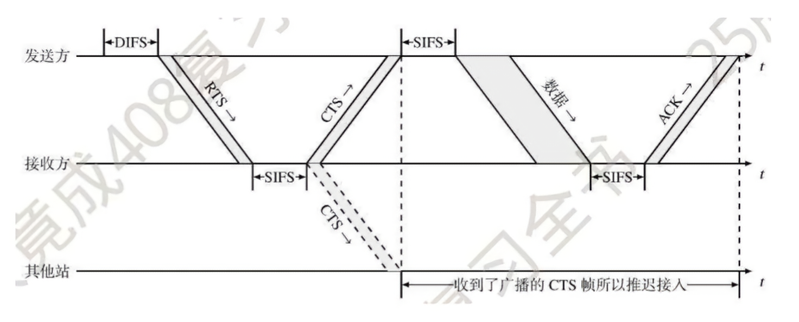
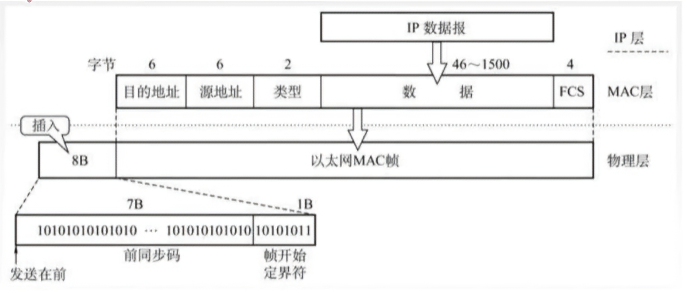

# 数据链路层

透明传输: 上层随便交付任何数据, 数据链路层都会完成传输 

> [!NOTE]   
> 透明在cs中, A对B透明, 即B不关心A的具体实现, 只需要使用A提供的服务    
> 就像我不关心车是怎么造出来的, 我只管开车就好    

差错控制: bit在链路中传输可能产生差错, 需要提供检测差错的功能   

流量控制: 数据链路层提供点对点的流量控制    

点对点即一个MAC地址/IP到另一个MAC地址/IP, 即手机到路由器、电脑通过网线到网卡、一个路由通过光纤到另一个路由  

## 封装成帧

有4种

#### 字符计数法
在帧首部使用`计数段`记录该帧所含的字节数, 包括计数段本身的1个字节也要算进去
```
如83479216509843672150
58347 59216 55098 54367 52150
在每帧的开头插入帧长5
```

#### 字符填充法
用SOH标明帧头, EOT表示帧尾  
如果帧中刚好有字符内容和SOH、EOT一致, 使用ESC来转义, 如果刚好也有内容和ESC一致, 那就转义两次

#### 零比特填充法
用01111110来标明帧的开头和结尾, 为不使段中的01111110被误判为帧的首尾, 需要对段中5个连续的1后插入一个0   
性能优于字符填充法

#### 违规编码法
以曼彻斯特类算法为例, 电平在时区内会跳变, 那么只需在帧首时区内全高电平, 帧尾时区内全低电平, 这样帧首尾时区均是不跳变的状态, 用来区别帧的界定

## 检错编码

#### 奇偶校验码

奇校验码和偶校验码的统称

码长共n位, 前n-1位为数据, 后1位为码校验位   
奇校验码: 附加码校验位后, 码内1的个数为奇数；偶校验码同理  

```
奇例1101 010->1101 0101  
偶例1101 010->1101 0100 
```

奇偶校验码只能校验奇数位的出错情况, 也不知道哪些位错了  
以奇校验为例 1101 0101发生偶数位错码0001 0101, 接受方验1的个数仍为奇数  

#### 循环冗余码CRC
例: 生成多项式$x^4+x+1$, 发送数据1101 0110 11
例省

## 流量控制与可靠传输机制

#### 停止-等待协议

无须关心有差错的情况有几种  
只需要按以下规则走  
无论如何, 只要在重传计时器规定时间内没有收到确认帧, 就会重新发送    
多余的数据或者确认帧会丢弃  
接收到当前的确认帧后才会发送下一个帧    

#### 后退N帧协议(GBN)

序列号位数＝$n$  
那么序列号范围就为$2^n$   
发送窗口大小最大为$2^n－1$    

例: 序列号位数＝3, 序列号范围有8位, 由0-7, 以发送窗口为$2^3$为例
```
首轮
[01234567] 01234567     
接收方完整接收, 发送ack1-7, 但ack5-7在途中丢失, 发送方只接收到ack4

移动窗口
01234[567  01234]567
此时接收方产生了错误, 它将
01234[567  01234]567当成了
01234567  [01234567]

因为在接收方认知里, 它对前8帧进行了确认, 
但发送方并没有接收到ack7, 于是重复发送了567, 
这重复的567又与01234组合成01234567, 
让接收方误认为是新发送的01234567

改进后, 窗口为7
[0123456]7 01234567
同样ack5-6丢失
窗口移动
01234[567  0123]4567
此时帧中间缺失了4, 明确隔开了567和0123
```

#### 选择重传协议SR

序列号位数＝$n$ 
那么序列号范围就为$2^n$     
发送窗口和接收窗口都需要≤$2^n$  
且发送窗口要大于接收窗口

信道利用率: 有效发送数据所占用的时间(发送时延), 占整个发送周期的比例
>GBN的信道利用率是停等的n倍, n为分组数

## 介质访问控制

分为静态信道划分和随机访问介质访问控制两大类

### 静态信道划分

又分4类

频分复用FDM: 将信道的总频带分为多个子频带, 每个子频带作为一个子信道进行通信

波分复用WDM: 光有不同波长, 将不同波长的光信号作为一条条信道进行通信

时分复用TDM: 将传输时间划分为等长的时间片, 称为TDM帧, 用户循环占用

>实际上频分复用和波分复用都可以理解为一条大马路, 划分了不同的车道供车辆行驶；而时分复用可以理解为特定的时间只能由特定车辆通过

码分复用CDM     
或者说更常用的码分多址CDMA: 
```
例: 有2个站进行CDMA通信, 其码片序列分别为
(-1 -1 -1 +1 +1 -1 +1 +1)
(-1 -1 +1 -1 +1 +1 +1 -1)
现接收到码片序列(-1 +1 -3 +1 -1 -3 +1 +1)


由接收到的码片序列对2站码片序列进行正交相加求平均
正交: 对应序列的两个数字相乘
求和: 。。
(+1 -1 +3 +1 -1 +3 +1 +1)＝8
(+1 -1 -3 -1 -1 -3 +1 -1)＝-8
求平均, 共8位
8/8=1
-8/8=-1
```

结果为  
`'1'`即发送1  
`'0'`即无发送     
`'-1'`即发送0 


>只要按照静态划分信道, 就一定不会发生冲突


### 随机访问介质访问控制

#### 纯ALOHA

不监听信道状态, 直接发, 没收到就等会再发 

#### 时隙ALOHA

不监听信道状态, 但是冲突发送后, 各站点冲突重发需要在一个时间片后开始, 各站时间片不一致

#### 载波监听多路访问CSMA

分为以下几种

| 信道状态 | 1-坚持   |  非坚持  | $p$-坚持 |
|----------|----------|----------|----------|
|   空闲   |立即发送数据|立即发送数据|概率$p$发送数据, 概率$1-p$推迟到下一个时候|
|   忙     |继续坚持监听|放弃监听, 等待一个随机的时间后再监听|持续监听,直到信道空闲再以概率$p$发送|


#### 载波监听多路访问/冲突检测CSMA/CD

用于总线型和半双工网络, 全双工采用双信道, 不可能冲突

主机最多经过2τ时长就能知道本次有没有碰撞    
这2τ时长称为争用期或碰撞窗口

以太网规定一个最短帧长  

最短帧长=总线传播时延×数据传输速率×2

当碰撞发生时, 已发送的帧如果长度不足最短帧长, 就视为无效帧, 丢弃

二进制指数退避算法: 当碰撞发生时, 发送方会随机选择一个退避时间

发送方会最多尝试重传16次, 如果16次都失败, 就会放弃  
k随重传次数增加而增加, 但是k最大为10    
每次重传时, 发送方从0到$2^k-1$中随机选择一个数, 记为$r$     
退避时间=$2rτ$

#### 载波监听多路访问/冲突避免CSMA/CA

用于无线局域网环境  
由于多设备的作用域不同, a设备范围覆盖路由器b, 但没有覆盖c设备, c也处于同样的处境, 此时就会造成a与c相互不知道的情况, 称为隐蔽站

802.11协议规定了RTS/CTS帧, 用于解决隐蔽站问题, 即让发送站预约信道



发送站首先间隔DIFS后发送RTS对信道进行预约, 随后接收方和发送方均需要间隔SIFS进行通信

间隔长度比较`DIFS>PIFS>SIFS`

> CD是检测, CA是避免


## 局域网

| 标准编号 | IEEE802.3 | IEEE802.11 |
|----------|----------|----------|
| 名称 | 以太网 | 无线局域网 |
| 逻辑拓扑 | 总线型 | 星型 |
| 物理拓扑 | 星型/拓展星型 | 星型 |
| 介质访问控制协议 | CSMA/CD | CSMA/CA |

### 以太网

以太网提供无连接, 不可靠服务

在局域网中, 硬件地址又称为物理地址(MAC地址)
MAC地址: 全球唯一的48位二进制地址, 前24位代表厂家, 后24位由厂家随机指定, 常用6个十六进制数表示



由于采用CSMA/CD协议, 因此有了最短帧长的概念,如果小于最短帧长,将毫无意义, 因此MAC帧最短为64B

由MAC帧必须有的`目的地址6B`, `源地址6B`, `类型2B`,`FCS4B`     
计算其长度为6+6+2+4=18B     
因此携带的数据至少需要有64B-18B=46B, 如果不足, 就会填充

| 标准名称 | 10BASE5 | 10BASE2 | 10BASE-T | 10BASE-F |
|-----|-----|-----|-----|-----|
| 传输介质 |  同轴电缆(粗缆)   | 同轴电缆(细缆) |  非屏蔽双绞线   |   光纤对(850nm)  |
|  拓扑结构   |  总线型  |  总线型  |  星型  |  点对点  |
|  最大段长  |  500m  |  185m  |  100m  |  2000m  |
|  最多结点数目  |  100  | 30 | 2 | 2 |


<table>
    <tr>
        <th>标准名称</th>
        <th>100Base-T</th>
        <th>吉比特以太网</th>
        <th>10吉比特以太网</th>
    </tr>
    <tr>
        <td>传输速率</td>
        <td>100Mb/s</td>
        <td>1Gb/s</td>
        <td>10Gb/s</td>
    </tr>
    <tr>
        <td>传输介质</td>
        <td>双绞线</td>
        <td>双绞线</td>
        <td>双绞线/光纤</td>
    </tr>
    <tr>
        <td>通信方式</td>
        <td colspan="2">支持半双工和全双工方式</td>
        <td>只有全双工方式</td>
    </tr>
    <tr>
        <td>介质访问控制</td>
        <td colspan="2">半双工下使用CSMA/CD</td>
        <td>无</td>
    </tr>
</table>

> 全双工下不需要使用介质访问控制, 因为全双工有两条路线, 不存在冲突

> 以太网中不存在确认帧!


### 无线局域网

无线MAC帧中的地址

- 地址1: 接收端MAC地址
- 地址2: 发送端MAC地址
- 地址3: 目的地址MAC地址
- 地址4: 源地址MAC地址

前两个地址是临时地址, 后两个地址不忘初心

以下为例    
`A----B----C----D`

A发送数据给D, 此时目的地址就为D, 源地址就为A    
但是MAC帧需要一小段一小段的传播, 所以地址1和2负责储存每一小段的接收端和发送端MAC地址        
如段1中, A发送给B, 那么地址1就是B, 地址2就是A   
段2中, B发送给C, 那么地址1就是C, 地址2就是B......类推


