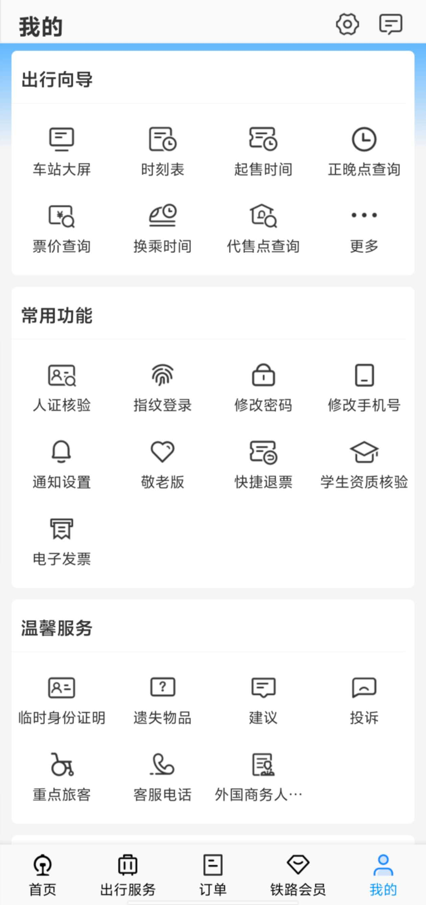
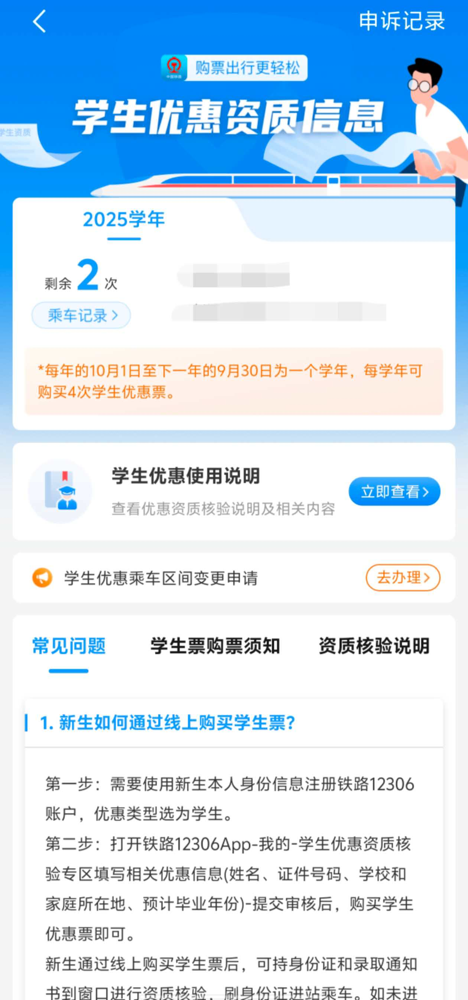
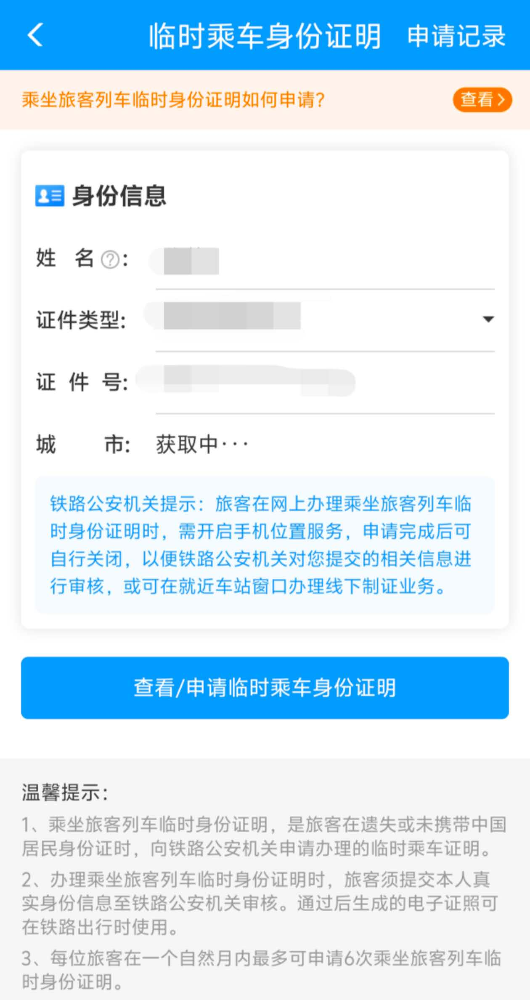

# 交通出行

如何有效高效订票乘坐高铁飞机?

短途选动车, 长途选飞机

长途价格一览如下
```
最便宜 绿皮硬座-绿皮硬卧-飞机-绿皮软卧-动车二等座-动车一等座-动车商务座-飞机商务座 最贵
```

## 高铁

请选择且 **仅选择** `12306 APP` 进行订票      
去哪儿、携程等软件本质仍是从12306订票, 稍有不慎就容易购买到附加的增值服务, 花不必要的冤枉钱

> 以下均基于12306版本号v5.8.0.4

### 学生补贴

进入APP后
在
```
我的-常用功能-学生资历核验
```
中查看



#### 时间、范围、次数

每学年(每年10月1日-次年9月30日), 可使用`4`次
于`家庭所在地`-`院校(实习)所在地`之间的`单程`
（以下简称`两地`）



```
泉州-杭州, 2月28号我从泉州出发前往杭州, 选择学生票, 即消耗一次学生优惠次数
```

#### 哪些人群可以使用学生补贴?

中、小学生(凭加盖学校公章的书面证明), 就读于公/民办中等专业学校、职业高中、技工学院的, 就读于全日制高等学校(本科/专科)的

#### 购买学生票后如何使用?

在动车上乘务员会要求你出示学生证或其他书面证明

#### 忘带学生证了怎么办?

按以下步骤

1. 假装翻找, 跟乘务员说等会再来, 如果乘务员忘了, 就算过关

2. 提前打开12306学生资历验证界面, 以及身份证(忘带也没事, 电子也行), 最好有学生证照片, 乘务员有概率让你过关

3. 如果乘务员依旧要求补票, 那就按要求补票, 支付后记得索要发票, 之后携带相关证件可在两地高铁站要求退款

#### 忘带身份证了怎么办?

12306上方搜索框搜索`临时身份证明`, 扫脸使用, 一个月可以忘带6次身份证  
安检、验票和出站走人工通道



### 订票篇

动车组列车

- CR字头, 复兴号  
- G字头, 意为“高”, 高速动车组列车, 最高运行时速300-350km/h    
- D字头, 意为“动”, 普通动车组列车, 最高运行时速200-250km/h    
- C字头, 意为“城”, 城际动车组列车, 最高运行时速160-350km/h, C字头根据各地线路条件决定运行速度 

普速列车：Z、T、K   

- Z字头, 意为“直”, 直达特快列车最高运行时速160km/h    
- T字头, 意为“特”, 特快列车最高运行时速140km/h    
- K字头, 意为“快”, 快速列车最高运行时速120km/h    

>在车站广播, 可以听到G123在广播中读为高幺贰叁, D321读为 动叁贰幺 

#### 座位

商务、一等不聊

二等座与无座:   

- 二等座即有固定位置, 可以从开头睡到尾       
- 无座并不是没有座位的意思, 而是`无固定座位`, 即某座位没有人就可以坐上去, 直到有人来  
- 餐车疑似可以坐得很舒服(没有试过)

硬座与硬卧: 

    硬座在五个小时以内一般可以承受, 一旦旅途超过10小时, 一定要选硬卧

>选座推荐   
安静、观景首选F、次选A  
屎尿屁多首选D、其次C    
B最烂

#### 太火热了买不到票怎么办

1. 中转 
- 什么是中转?    
    ```
    如泉州南-杭州东, 我选择在上海虹桥中转,  就有 泉州南-上海虹桥-杭州东
    ```
- 中转时该怎么办?     
    看站台`地面指标`, 有中转箭头, 跟着走一般就能看到出发层`检票口下到站台`的台阶, 走上去就行    
    或者找`站台电梯`, 挤进去按出发层的楼层就行    
    `总之就是回出发层`, 然后按第二班的班次走就行  
- 中转的时间控制?  
    20分钟在大站中转也是绰绰有余的, 15分钟就稍微要快点了, 大站不建议10分钟以下中转  
    小站随便来

> 自定义中转时, 注意中转抵达车站与中转出发车站是否是同一车站    
同一城市可能有多个动车站    
例如上海有上海站、上海虹桥站、上海南站等

2. 买长乘短和买短补长   

    买长乘短就是多买几站    
    ```
    如武汉汉口-南京南, 多买三站到上海虹桥   
    在南京南下车, 后面三站就不坐了  
    或者泉州南-杭州东, 多买一站厦门北   
    ```

    买短乘长    
    少买, 但是在车上补票
    ```
    如武汉汉口-苏州站, 只买到南京南, 然后上车后快到的时候找乘务员补票到苏州站
    ```

### 出行中

在有地铁的城市, 高铁站下一定一定有地铁站    
地铁所在的层我们姑且称为地铁层  
出地铁站后, 我们就到达了抵达层  
再往上走, 就到达了出发层, 出发层通过对应窗口到达站台    

层级关系如下    
```
出发层(动车站内)
站台(动车所在)
抵达层(可能有商圈)
地铁层(地铁所在)
```

人员流动: 
```
                       驱车
                        ↓
出发：地铁-地铁站-出站-抵达层-出发层-安检-站台-动车->
抵达：动车-站台-抵达层->
```

>注意出发层一定在抵达层上面, 如果你在抵达层找不到出发层, 四处望望有没有扶手电梯等可以让你上楼的地方

#### 安检
危险物品不必多说    
```
液体：洗面奶/沐浴露等, 可以带, 别带太多太离谱就行
喷雾发胶, 有可能叫你拿出来看看
水, 过安检时喝一口
```
>如果是不方便过安检机的东西, 如吉他、羽毛球拍, 你可以要求人检, 拿给安检员让他手动检查, 如果死活不同意, 就告诉他东西很贵, 如果被损坏了就要投诉和要求赔偿

#### 检票

一般最后出发时间前15分钟开始检票, 除非你所在动车站是大站(杭州东站、南京南站、上海虹桥)且行李多, 或者所在站是该班次始发站(本趟起点), 不然没必要去排队, 坐一会跟在最后面进去就行

##### 为什么?
- 大站且行李多：下来乘客多, 排前面放行李
- 始发站：都是空位随便放行李
- 小站：下不了几个人, 排前面也没地方放行李

##### 排后面又行李多怎么办?  
插队, 动车停靠位置每次并不确定, 排好的队最后一定会乱掉, 可以根据12306所给座位信息和车厢外屏幕显示的座位信息找到最少人且相对近的车门口, 等下车的人都走后上车
```
例：12306上有 5车12F
车厢屏幕显示：
    6 车
头       18-1      尾
```

#### 找到所在车厢：

下站台, `看大屏幕`, 会告诉你往前还是往后      
然后再看`地标颜色`, 走得差不多了再往前看对应颜色的地标提示几车    

在一些先进点的动车组(CR/G/D)中, 可以通过座位上方的指示灯判断座位有没有人      
指示灯通常为红绿色, 红色表示对应座位已有人, 绿色表示为空位, `无座就可以坐过去`

#### 充电
一般来说CR/G/D/C都会提供插座, 只有少数班次没有提供(前年在成都-重庆的C上就遇到过)    
一般先往下往前看, 如果`前一排的下面`没有, 那就是在本排的`座位底下`, 在自己和隔壁座位之间, 用手一探一般就能摸到, 提供两插头和三插头  
且前座的背椅后一般也提供一个USB-A插口   

#### 挂衣服

一般动车上开放暖/冷气, 衣服可以挂在

- 前座上有凸起
- 靠窗的座位观察上方有一个小按钮, 按下去弹出一个小衣叉

一般在抵达前5分钟收东西, 不用急, 时间是够的, 当然如果你行李埋太里面你可能得提前半小时挖出来         
下车后顺人流走到抵达口刷身份证出站      

睡过站怎么办? 找乘务员, 他会联系工作人员安排路过的动车捎你回去  

## 飞机

个人推荐微信小程序同程旅行订票, 部分航班有返现100活动, 试过多次, 如果没返打电话问客服

机票费用分为票价与机建燃油

- 机建燃油一般在60-110人民币之间(国内), 可能随旅途长度改变

机票分国内与国际, `国际`机票推荐`提前一个月`以上订票    
`国内`机票视出行日期`是否旺季`决定      
如果是旺季(春运五一国庆), 其实临期或者提前订都没什么作用, 该贵就是贵    
工作日/淡季订票推荐`临期`订票, 一般`出发日3到5天内`机票最便宜   
注意看有没有免费托运    
订票时`不要直接点看起来最便宜的一个就付款`了, 每个都点进去看看多少钱, 有时候捆绑一个飞行保障大礼包你就老实了

提前至少两小时抵达航站楼    
大的国际机场一般有平地快速电梯, 上去能让你走快点    
首先找自动机器凭身份证取票, 然后拿机票和身份证到托运处办理托运      

安检处需要把所有电子产品/口袋里的所有东西都拿出来放到安检篮子里     
水、打火机过不了安检, `保温杯里就不要装水了`      
充电宝别带2万毫安以上的     

过完安检就可以找自己的登机口, 等就行    

登机后手机不需要关机, 只需要在起降时开下飞行模式    

落地后跟人流走, 有行李的等行李转出来, 没有的就可以直接走了, 且大机场下面必有地铁
